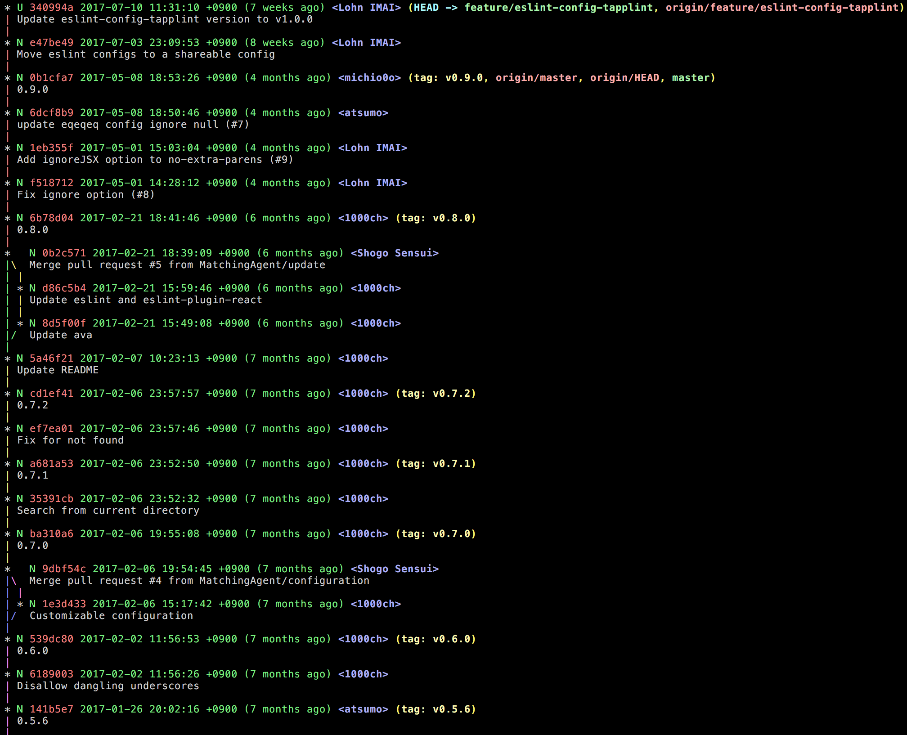
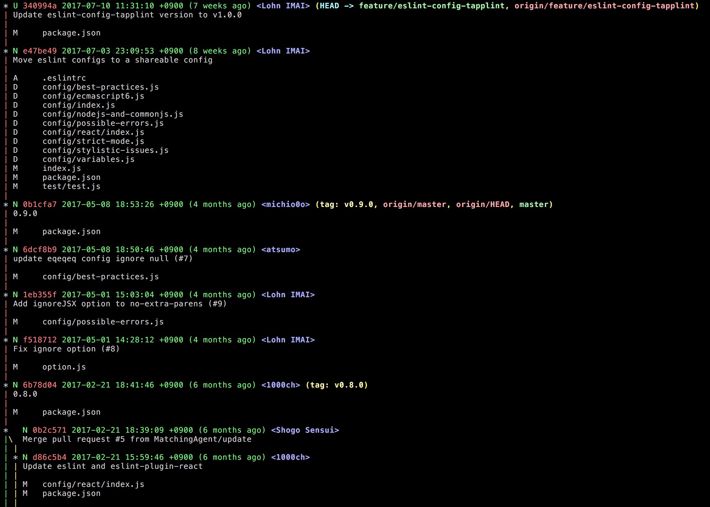
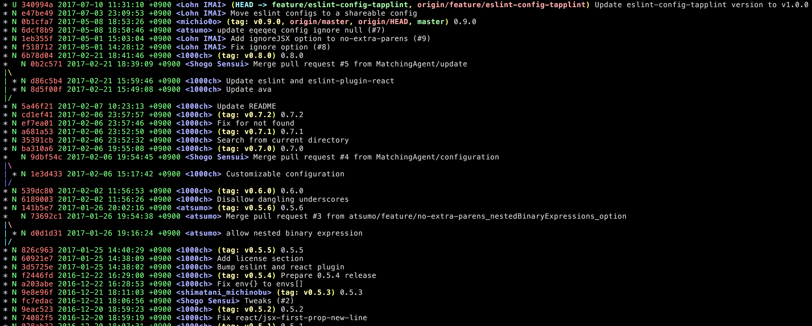
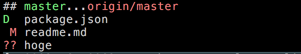
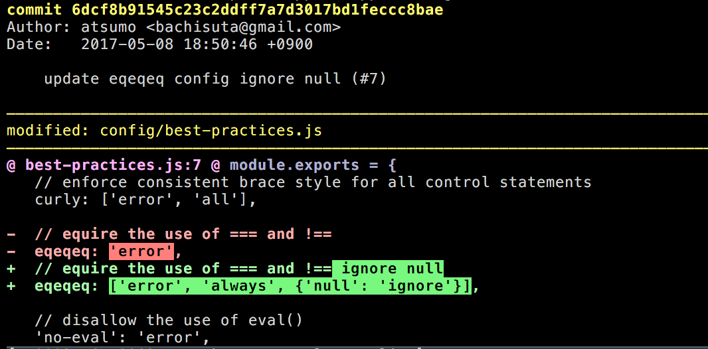

## ぼくのかんがえた
## さいつよの

# .gitconfig

#### (コマンドライン編)

---

### みなさん
### gitコマンド叩いてますか？

---

### ぼくはgitコマンドがないと
### 生きていけないんじゃないか
### ってぐらいに...
### gitコマンドしか叩いてません |

---

```sh
$ history 1 | awk '{ print $2 }' | sort | uniq -c | sort -r | head
5028 git
 274 ls
 175 cd
 105 less
 104 npm
 102 yarn
  85 curl
  82 vim
  76 brew
  62 tapple-vpn
```
@[2](会社PCでは堂々の１位🎊)

---

```sh
$ history 1 | awk '{ print $2 }' | sort | uniq -c | sort -r | head
30954 git
2168 ls
1584 cd
1402 vim
1053 npm
809 ssh
719 brew
453 less
386 rm
297 curl
```
@[2](自宅PCでも圧倒的１位🎉)

---

### そんなぼくの
### gitconfigを
### 紹介します

---

### コンテンツ

- 基本の設定 |
- gitconfigの雄 Alias |
- ストレスを減らす diff-so-fancy |
- おまけ .gitignore-default |

---

### 基本の設定

```
[user]
    name                = "Lohn IMAI"
    email               = mail@lohn.me
    signingkey          = ACAA5506D649E281

[commit]
    gpgsign             = true

[core]
    editor              = vim
    pager               = less -RS
    excludesfile        = ~/.gitignore-default
    autocrlf            = input

[push]
    default             = upstream

[interactive]
    singlekey           = true

[color]
    ui                  = true

[log]
    date                = iso8601

```
@[4-7](いつもGPGでこっそりサインしています。)
@[9-13](autocrlf = inputは割と必須)
@[15-16](git pushを叩いたら現在のブランチを現在のupstreamに送信する設定)
@[18-19](インタラクティブモードの設定。これははかどります。)

---

### gitconfigの雄 <span style="color: #e49436; text-transform: none">Alias</span>

```
[alias]
    show-alias          = !git config --list | grep 'alias\\.' | sed 's/alias\\.\\([^=]*\\)=\\(.*\\)/\\1\\\t => \\2/'
    a                   = add -p
    ad                  = add
    b                   = branch
    ba                  = branch --all
    br                  = branch --remote
    c                   = commit
    cm                  = commit --message
    chp                 = cherry-pick
    co                  = checkout
    d                   = diff
    dc                  = diff --cached
    f                   = fetch --prune
    fa                  = fetch --prune --all
    g                   = grep -nH --break --color --heading
    ig                  = !"gi() { curl -L -s https://www.gitignore.io/api/$@ ;};gi"
    ignore              = !"([ ! -e .gitignore ] && touch .gitignore) | echo $2 >> .gitignore"
    info                = remote show origin
    l                   = log --graph --pretty=format:'%C(green)%G? %C(red)%h %C(green)%ad (%ar) %C(bold blue)<%aN>%C(reset)%C(auto)%d%n%s%n'
    la                  = log --graph --pretty=format:'%C(green)%G? %C(red)%h %C(green)%ad (%ar) %C(bold blue)<%aN>%C(reset)%C(auto)%d%n%s%n' --all
    lv                  = log --graph --pretty=format:'%C(green)%G? %C(red)%h %C(green)%ad (%ar) %C(bold blue)<%aN>%C(reset)%C(auto)%d%n%s%n' --name-status
    lva                 = log --graph --pretty=format:'%C(green)%G? %C(red)%h %C(green)%ad (%ar) %C(bold blue)<%aN>%C(reset)%C(auto)%d%n%s%n' --name-status --all
    lo                  = log --graph --pretty=format:'%C(green)%G? %C(red)%h %C(green)%ad %C(bold blue)<%aN>%C(reset)%C(auto)%d %s'
    loa                 = log --graph --pretty=format:'%C(green)%G? %C(red)%h %C(green)%ad %C(bold blue)<%aN>%C(reset)%C(auto)%d %s' --all
    s                   = status --branch --short
    update-master       = push . origin/master:master
```
@[1-27](基本的に1-3文字で設定しています。)
@[17](gitignore.ioから設定持ってきます。新しいリポジトリ用)
@[18](git ignore hoge ってやると、hogeが .gitignore に追記される)
@[20-25](gitログのツリー表示。細かな設定しています。)
@[26](statusをシンプルにします。)
@[27](トピックブランチにいる時に、ローカルmasterをorigin/masterで上書き)

+++

#### git l



+++

#### git lv



+++

#### git lo



+++

#### git s



---

### ストレスを減らす <span style="color: #e49436; text-transform: none">diff-so-fancy</span>

```
[pager]
    show                = diff-so-fancy | less --tabs=4 -RFX
    diff                = diff-so-fancy | less --tabs=4 -RFX

[interactive]
    diffFilter          = diff-so-fancy --patch-mode | less --tabs=4 -RFX

[color "diff-highlight"]
    oldNormal           = red bold
    oldHighlight        = red bold reverse
    newNormal           = green bold
    newHighlight        = green bold reverse

[color "diff"]
    meta                = 227
    frag                = magenta bold
    commit              = 227 bold
    old                 = red bold
    new                 = green bold

[diff-so-fancy]
    stripLeadingSymbols = false
```

+++

### ストレスを減らす <span style="color: #e49436; text-transform: none">diff-so-fancy</span>



---

### おまけ .gitignore-default

```
,*

*~
*.tmp
*.swp
~\$*
.DS_Store
Thumbs.db
desktop.ini

.sass-cache
.gem
.rvm
# Gemfile.lock
vendor/bundle
public/assets
public/data
public/apk
public/shop_map
.bundle
.jbundler

# SublimeText settings
*.sublime-project
*.sublime-workspace
sftp-config.json

# Adobe Bridge cache file
.BridgeCache
.BridgeCacheT

xcuserdata/

.rbenv-gemsets
.sync-config.cson


# Created by https://www.gitignore.io/api/intellij

### Intellij ###
# Covers JetBrains IDEs: IntelliJ, RubyMine, PhpStorm, AppCode, PyCharm, CLion, Android Studio and Webstorm
# Reference: https://intellij-support.jetbrains.com/hc/en-us/articles/206544839

# User-specific stuff:
.idea/**/workspace.xml
.idea/**/tasks.xml
.idea/dictionaries

# Sensitive or high-churn files:
.idea/**/dataSources/
.idea/**/dataSources.ids
.idea/**/dataSources.xml
.idea/**/dataSources.local.xml
.idea/**/sqlDataSources.xml
.idea/**/dynamic.xml
.idea/**/uiDesigner.xml

# Gradle:
.idea/**/gradle.xml
.idea/**/libraries

# Mongo Explorer plugin:
.idea/**/mongoSettings.xml

## File-based project format:
*.iws

## Plugin-specific files:

# IntelliJ
/out/

# mpeltonen/sbt-idea plugin
.idea_modules/

# JIRA plugin
atlassian-ide-plugin.xml

# Cursive Clojure plugin
.idea/replstate.xml

# Crashlytics plugin (for Android Studio and IntelliJ)
com_crashlytics_export_strings.xml
crashlytics.properties
crashlytics-build.properties
fabric.properties

# Sonarlint plugin
.idea/sonarlint

# End of https://www.gitignore.io/api/intellij

```
@[1](勝手にカンマファイルと呼んでいる、ローカルでしか使わないスクリプトをignore)

---

### みなさんぜひgitコマンドを
# 使いましょう！！

---

## ご清聴ありがとうございました
